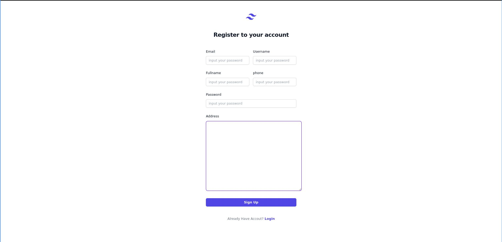

# Adonis fullstack application

This is the fullstack boilerplate for AdonisJs, it comes pre-configured with.

1. Bodyparser
2. Session
3. Authentication
4. Web security middleware
5. CORS
6. Edge template engine
7. Lucid ORM
8. Migrations and seeds

# Preview
| login | register | dashboard | users | books |
|-------|----------|-----------|-------|-------|
|    <br> [link preview]()   |   <br> [link preview]()      |           |       |  <br> [link preview]()       |
|       |      |           |       |       |
|       ||           |       |       |
|       |          |           |       |       |
## Setup

Use the adonis command to install the blueprint

## Setup tailwind 
```bash
npm i -D tailwindcss postcss-loader postcss autoprefixer
```
```bash
npx tailwindcss init -p
```

uncomment 

```js
Encore.enablePostCssLoader()
```
Edit tailwind.config.js
```js
/** @type {import('tailwindcss').Config} */
module.exports = {
  content: [
    './resources/**/*.{edge,js,ts,vue,tsx,jsx}'
  ],
  theme: {
    extend: {},
  },
  plugins: [],
}
```

add this code to app.css
```css
@tailwind base;
@tailwind components;
@tailwind utilities;
```
## Add DaisyUI
```bash
npm i -D daisyui@latest
```

## Add plugin tailwindcss
```bash
npm install -D @tailwindcss/typography @tailwindcss/forms
```

### Migrations

Run the following command to run startup migrations.

```js
adonis migration:run
```


# Configuration DB

## Database setting

```
npm i @adonisjs/lucid@18.4.0
```

```
node ace configure @adonisjs/lucid
```

buka .env untuk setting environment variable sesuaikan dengan konfigurasi database
## Membuat model

```
adonis make:model namaTabel -cm
```

command diatas membuat model beserta migration
edit table di folder database/migration
setelah melakukan edit menambahkan table column maka selanjutnya menjalankan migration:run

```
adonis migration:run 
```

## Membuat authentication user
```
npm i @adonisjs/auth@8.2.3
```

```
node ace configure @adonisjs/auth
```

## membuat controller
```
node ace make:controller Post
```

## Configurasi routing adonis

Konfigurasi routing pada adonisjs berada pada folder start/routes.js. Vscode mempermudah pencarian dengan menggunakan shorcut ctrl+p lalu ketik 'routes.js'

```javascript
Route.get('/', 'HomeController.index')
Route.post('/', 'HomeController.index')
```

kodingan diatas merupakan potongan kode untuk penggunaan routes adonis.

## validator
```
adonis install @adonisjs/validator
```

tambahkan di app.js
'@adonisjs/validator/providers/ValidatorProvider'

## membuat data seed
```
adonis make:seed <namaTable>
```

1. setelah menggunakan command diatas file seed berada pada ./database/seeds
2. edit 
3. pada factory.js isi Factory.blueprints sesuai dengan nama models atau table
4. command 'adonis seed'
5. table sudah terisi


## LOG progress

- [ ] Home page 
- [ ] Dashboard page 
- [ ] About page 
- [ ] CRUD Post blog 
- [ ] Login page 